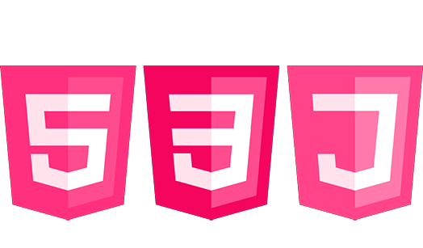
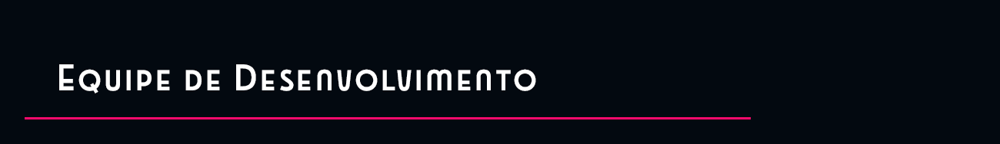

   

  O projeto do Banco de Tempo, trabalho de conclusão de curso da turma 13 do programa Mulheres in Tech da Fly, foi desenvolvido com o intuito de sintetizar os conhecimentos adquiridos ao longo da jornada de aprendizado proposta pelo programa.

  Banco de Tempo é uma plataforma onde pessoas podem trocar serviços e habilidades entre si, com o tempo como moeda. Este projeto é uma reinterpretação do conceito original do Banco de Tempo, com nova identidade visual e funcionalidades.

🖼️ Logotipo: pré-existente, feito por um designer voluntário e atribuído ao Banco de Tempo original.

🎨 Identidade visual, wireframe e protótipo: Malunari Design Gráfico (membro do
grupo). Protótipo feito no Adobe Photoshop 2024, com conversão para Figma.

🖥️ Telas Disponíveis: 7 telas principais da aplicação implementadas.

⏳ Sistema de Troca de Tempo: Permite que usuários registrem e troquem horas para diferentes tipos de serviços.

👤 Gestão de Perfil: Cada usuário possui um perfil personalizado com informações de habilidades e tempo disponível para troca.

📋 Modais Interativos:  A interface possui 3 modais interativos para uma melhor experiência de navegação.

O projeto foi desenvolvido utilizando as seguintes tecnologias de front-end:

  

##

Essas tecnologias foram utilizadas para criar uma interface intuitiva e responsiva, garantindo uma experiência de usuário agradável e prática.

HTML: Estruturação da página — a base que define o conteúdo e a organização dos elementos.

CSS : Estilização e layout, trazendo cores, fontes e espaçamento.

JavaScript : Interatividade na página — usado para criar menus dinâmicos.

Ana Catalão - Carla Carlos Sá - Lorena Mendonça - Malunari Pinto - Marilu Dourado - Nicole Melo 
